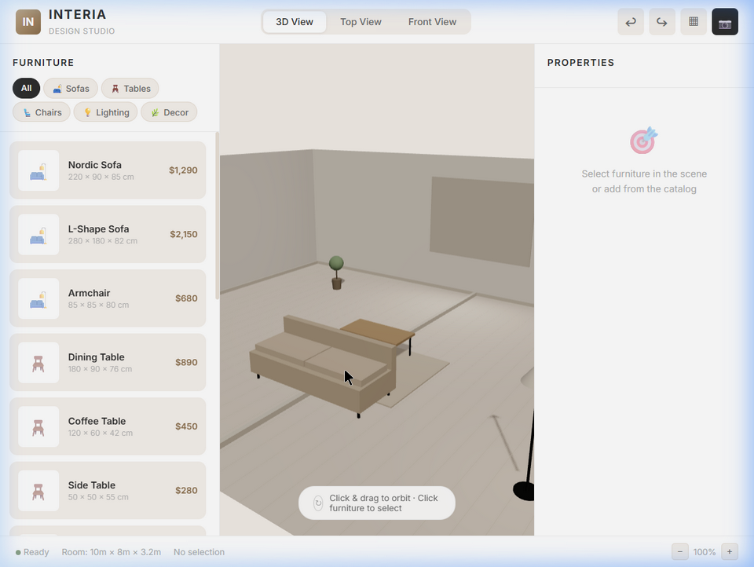
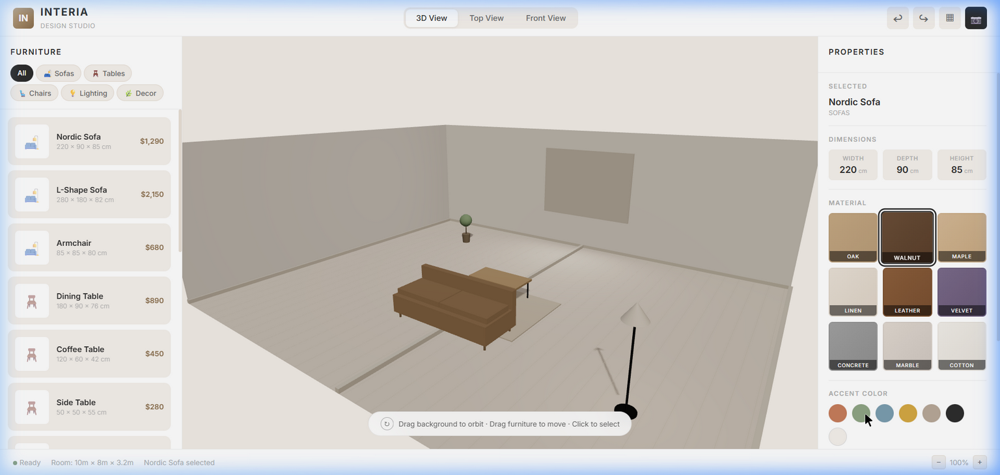

# INTERIA — 3D Interior Design Preview

🏠 **INTERIA** is a 3D interior design preview tool built for furniture brands and designers. It provides an immersive, interactive environment where users can visualize furniture in a realistic room setting, customize materials and colors, and experiment with spatial arrangements.



## Features

- **Interactive 3D Room**: A fully realized 3D room with warm directional and ambient lighting, soft shadows, and orbit controls (pan/zoom/rotate).
- **Drag-and-Drop Placement**: Effortlessly drag furniture around the room to adjust layouts.
- **Procedural 3D Furniture**: Includes 15+ procedurally generated 3D models across 5 categories (Sofas, Tables, Chairs, Lighting, and Decor).
- **Material & Color Customization**: Switch between 9 high-quality material swatches (Oak, Walnut, Maple, Linen, Leather, Velvet, Concrete, Marble, Cotton) and 7 accent colors instantly on any selected piece of furniture.
- **Transform Controls**: Precise slider controls for rotation (0°-360°) and scale (50%-150%) of individual items, along with exact dimension readouts (Width × Depth × Height).
- **Multiple View Modes**: Switch between immersive 3D View, Top View (bird's-eye perspective), and Front View for precise alignment.
- **Nordic Minimalist Aesthetic**: A polished glassmorphism UI featuring a clean wood, beige, and dark gray palette.
- **Mobile Warning**: Automatically detects smaller screens and prompts users to switch to a desktop for the optimal 3D editor experience.



## Technology Stack

- **HTML5 & Vanilla CSS**: Clean structure with a modern layout, CSS variables, and CSS Grid/Flexbox. No frameworks required.
- **JavaScript (ES Modules)**: Modular code separating scene logic (`scene.js`) from UI handling (`app.js`).
- **Three.js (r184)**: Used for all 3D rendering, imported natively via ES Module import maps—no bundler or `npm install` needed.

## Quick Start

Since INTERIA uses ES modules via import maps, it needs to be served over HTTP/HTTPS (not directly from the `file://` protocol).

1. Clone or download the repository.
2. Serve the directory using any local web server. For example, if you have Node.js installed, you can use `serve`:

   ```bash
   npx serve .
   ```

3. Open your browser and navigate to `http://localhost:3000` (or the port provided by your server).
4. **Note:** INTERIA is designed for desktop screens to take advantage of drag-and-drop interactions and the detailed 3D viewport.

## How to Use

1. **Add Furniture**: Click on any item in the left "Furniture" panel to add it to the scene.
2. **Select & Move**: Click and drag any piece of furniture in the 3D viewport to move it around the room floor.
3. **Customize**: When an item is selected, use the right "Properties" panel to change its material or accent color.
4. **Transform**: Use the rotation and scale sliders in the right panel to fine-tune the selected item's placement.
5. **Camera Controls**: Click and drag the empty background to orbit the camera around the room. Use the scroll wheel (or the zoom buttons) to zoom in and out.
